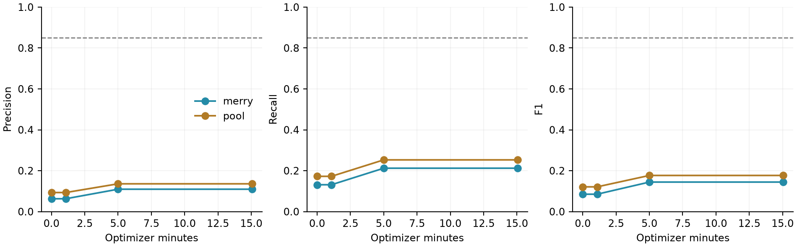
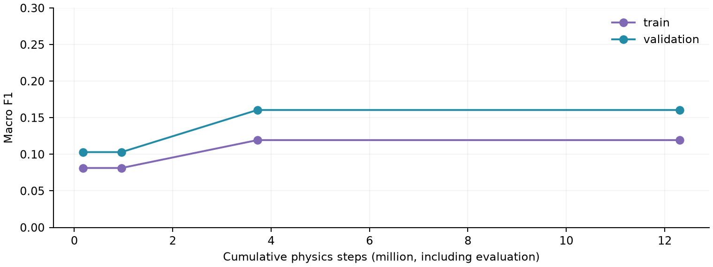
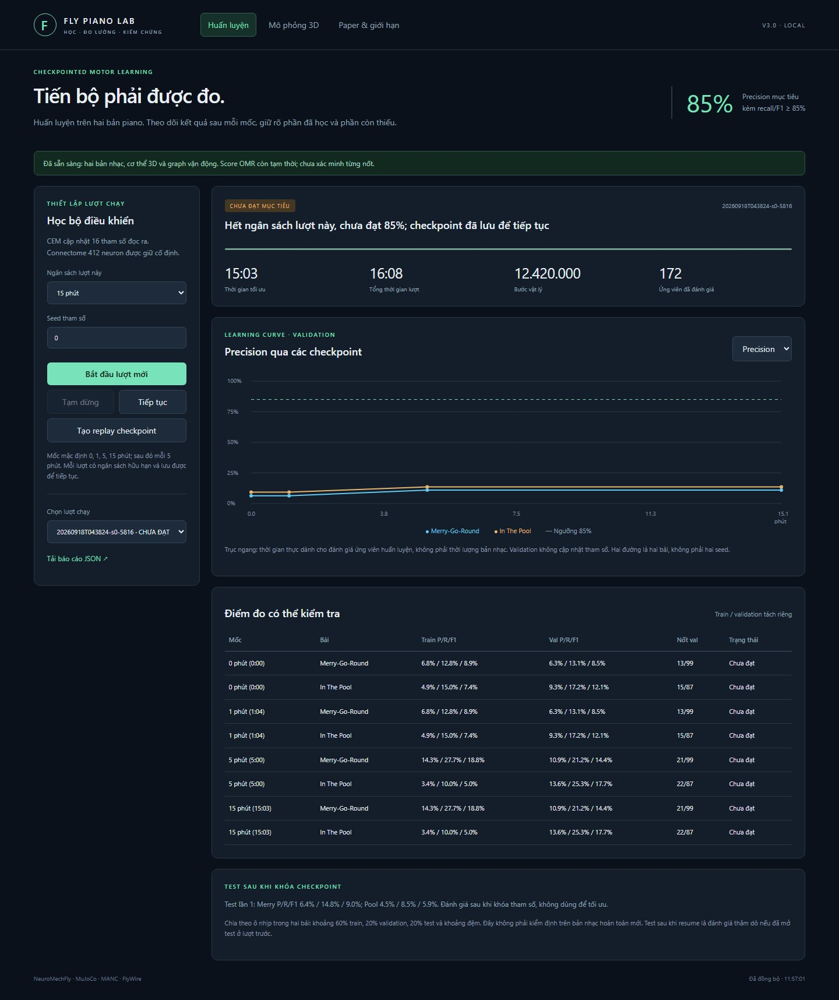
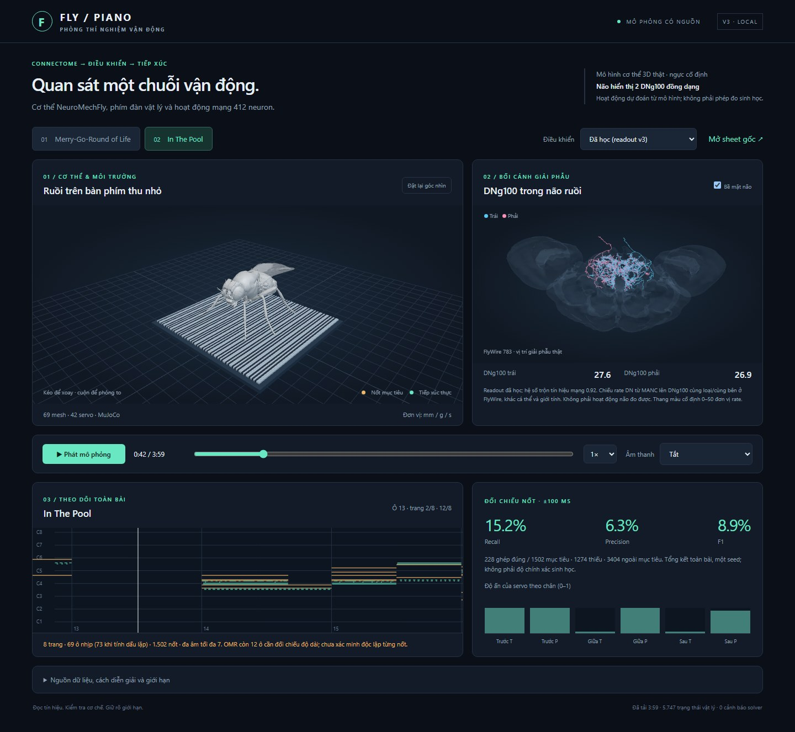

# Fly Piano Lab v3: tối ưu bộ điều khiển tiếp xúc trên mô hình ruồi có connectome cố định

Bản thảo nghiên cứu phương pháp bằng tiếng Việt · 18-09-2026 · Nghiên cứu thăm dò, chưa sẵn sàng nộp journal

## Tóm tắt

Mục tiêu của nghiên cứu là đo xem tối ưu một bộ đọc ra vận động nhỏ có cải thiện độ chính xác tiếp xúc trên hai chuỗi piano hay không, khi giữ cố định connectome, hình học và bộ phát hiện nốt. Hệ thống kết hợp phân đồ thị VNC gồm 412 neuron, cơ thể NeuroMechFly, động lực học MuJoCo và bàn phím cảm biến thu nhỏ. Thuật toán cross-entropy method (CEM) học 16 tham số hình học/thời gian/điều biến, không cập nhật synapse. Hai bản piano đầy đủ được chép bằng OMR và vẫn có trạng thái tạm thời. Một lượt seed 0 được đánh giá tại các mốc 0, 1, 5 và 15 phút tính toán tối ưu, với tập đoạn validation cố định và tập test mở sau khi khóa checkpoint. {{ABSTRACT_RESULT}} Giao diện cung cấp learning curve, tiếp tục từ trạng thái đã lưu, replay cơ thể 3D và phép chiếu hoạt động mô hình lên hai skeleton DNg100 có nguồn. Kết quả chỉ hỗ trợ đánh giá tính khả thi của pipeline; chưa chứng minh ưu thế connectome, học thần kinh sinh học hoặc khái quát hóa sang tác phẩm mới.

## 1. Câu hỏi, phạm vi và đóng góp

Một mô hình có thể phát sinh nhịp mà vẫn thất bại khi tạo tiếp xúc đúng nốt. Nghiên cứu này đặt câu hỏi hẹp: với cùng cơ thể, score và bộ phát hiện tiếp xúc, việc tối ưu bộ đọc ra có thay đổi precision/recall/F1 theo ngân sách tính toán như thế nào? Giả thuyết thăm dò là F1 trên các đoạn validation trong cùng tác phẩm tăng so với checkpoint ban đầu. Đây chưa phải giả thuyết về lợi ích riêng của connectome: muốn quy kết điều đó phải tối ưu các đối chứng cùng ngân sách và cùng thông tin.

Đóng góp hiện tại gồm pipeline học có trạng thái lưu được, đánh giá phân tách train/validation/test, hai demonstration toàn bài, và cách trình bày hoạt động mạng không nhầm với phép đo não. Hai nguyên lý định hướng vẫn là điều khiển nhịp theo phân cấp và tái sử dụng primitive. Bộ điều khiển hiện tại dùng các pha reach/press/release do kỹ sư định nghĩa; nghiên cứu chưa chứng minh primitive hoặc tính bất biến được học một cách tự phát. Chúng tôi không nhận tính mới của connectome, NeuroMechFly hoặc phương pháp CEM.

Các công trình mô hình não [1], mạch CPG [2], NeuroMechFly [3] và graph-policy [4] là cơ sở và prior art. Khác với khẳng định whole-brain controller, v3 giới hạn động lực mạng ở một phân đồ thị VNC và giữ đường score-to-IK công khai. Khuyến nghị đánh giá thực nghiệm [8,9] thúc đẩy việc báo cáo đường học, chi phí tương tác và bất định; một seed ở đây không đáp ứng yêu cầu suy luận thống kê rộng.

## 2. Dữ liệu và hệ thống mô phỏng

### 2.1. Hai bản piano và độ tin cậy của mục tiêu

Merry-Go-Round of Life sử dụng bản piano 10 trang người dùng thay thế, không dùng bản tứ tấu dây 17 trang cũ. Bản chép gồm 237 ô nhịp, 2.401 sự kiện nốt, cao độ MIDI 27–100 và thời lượng danh định 316,039 giây. In The Pool có 8 trang, 69 ô viết, mở dấu lặp ô 39–42 thành 73 lượt ô nhịp, 1.502 sự kiện, cao độ 28–95 và thời lượng 238,457 giây. Mức đa âm giữ nốt tối đa lần lượt là 8 và 7, có thể vượt giới hạn phân công sáu chân.

Audiveris 5.11.0 tạo bản OMR; parser mở lặp và đổi tempo về đơn vị nốt đen, kể cả nốt đen chấm dôi. Còn 3 cờ độ dài ô ở Merry và 12 ở Pool. Bao phủ toàn trang không đồng nghĩa đúng từng pitch/onset/offset. Vì chưa có hai lượt chép độc lập hoặc MusicXML được xác nhận, mọi metric là độ khớp với mục tiêu OMR tạm thời. Bản nhạc không được dùng làm bằng chứng âm nhạc chuẩn. MusicXML kèm PDF đối chiếu là đầu vào ưu tiên; MIDI kèm sheet đứng sau. MP4 chỉ cần khi nghiên cứu rubato, pedal hoặc phong cách biểu diễn.

### 2.2. Connectome và kênh thông tin

Phân đồ thị có 2 DNg100, 18 interneuron CPG ứng viên và 392 motor neuron; tổng cộng 2.592 cạnh với 18.831 synapse, chỉ 7 cạnh liên chân. Nguồn mã [2] được khóa tại commit 10e7661bf414ba7b4c2edf795cd36d0f878c17c0. Export nền có tên W_20260522_allSynapses; phiên bản neuPrint nền và quyền tái phân phối connectivity export vẫn chưa được xác nhận đầy đủ. Neuron rate, dấu kết nối suy từ thông tin neurotransmitter và projection feedback đều là giả định mô hình.

Đường thông tin là score → scheduler biết onset tương lai → phân công chân → inverse kinematics (IK) → servo khớp. Mạng VNC nhận tonic drive và phản hồi giả định, rồi điều biến gate ấn. Vì decoder đã biết nốt và thời gian, mạng không tự chọn bản nhạc. Với tham số trộn m, gate = (1 − m) + m × clip(8 × gain × đầu ra mạng, 0, 1). Nếu m về 0, bộ đọc ra bỏ qua mạng; khả năng này phải được báo cáo khi diễn giải học.

### 2.3. Cơ thể và tiếp xúc

Cơ thể dùng NeuroMechFly/FlyGym 2.1.0 với 69 mesh và 42 position actuator trong MuJoCo 3.9.0. Ngực cố định. Bàn phím gồm 88 dải cùng mặt phẳng, cao độ 21–108, khoảng cách 0,055 mm, lò xo phím 5 theo hệ đơn vị mm–g–s và khối lượng phím 0,000002 g. Lực trong hệ này là µN. Đây là giao diện cảm biến thu nhỏ, không phải piano chuẩn hoặc một mô hình cơ-gân đã hiệu chuẩn.

Bước vật lý là 0,2 ms, bước mạng 2 ms. Tư thế IK bị giới hạn kỹ thuật quanh neutral ±1,35 rad; không chuyển vị chân tức thời trong rollout động lực học. Nốt được phát hiện khi lực toe–key đạt ít nhất 0,003 µN trong 16 ms; ngả khi dưới 0,0015 µN trong 24 ms, với refractory 40 ms. Detector giữ nguyên qua mọi checkpoint. Đầu chân có thể kích hoạt nhiều phím; các nốt thừa vẫn được tính. Chưa có torque limit từ dữ liệu cơ, kiểm chứng lực thực hoặc self-collision đầy đủ.

## 3. Phương pháp học và đánh giá

### 3.1. Những gì thực sự được học

CEM tối ưu 16 tham số: 6 lệch ngang chân trong [−0,09; 0,09] mm; 6 lệch độ sâu trong [−0,10; 0,10] mm; anticipation trong [0; 0,14] s; neural gain [0,2; 2]; neural mix [0; 1]; và release shift [−0,04; 0,02] s. Connectome, score, phím, actuator và detector không được học. Đây là tối ưu tham số controller bằng đánh giá mô phỏng, không phải synaptic learning hoặc học trí nhớ của ruồi.

Mỗi thế hệ có 6 ứng viên lấy mẫu từ Gaussian chéo bị chặn miền và 1 incumbent. Mỗi ứng viên chạy một đoạn 6 giây lấy ngẫu nhiên từ miền train của mỗi bài. Hai elite cập nhật mean/sigma với trọng số mới 0,7; sigma chuẩn hóa có sàn 0,035. Ứng viên tốt nhất trên batch phải vượt incumbent về macro-F1 trên train-monitor cố định, một đoạn 6 giây mỗi bài, mới thay checkpoint tốt nhất. Train-monitor là dữ liệu huấn luyện dùng nhiều lần và có thể bị overfit. Validation không chọn tham số nhưng dùng cho tiêu chí dừng.

Khởi tạo tương đương controller full v2. Kiểm tra 4 giây ban đầu cho cùng 64 sự kiện tiếp xúc và 4 ghép đúng ở cả hai pipeline trên host hiện tại. Đây là kiểm tra parity cục bộ, không chứng minh mọi rollout hoặc mọi hệ điều hành giống nhau.

### 3.2. Chia dữ liệu và ngân sách

Mỗi tác phẩm chia theo ô nhịp theo thời gian, xấp xỉ 60% train, 20% validation, 20% test; loại ô nhịp ở ranh giới để tạo khoảng đệm. Đây là held-out trong cùng tác phẩm. Motif có thể lặp qua ranh giới; split không chứng minh khái quát hóa sang tác phẩm mới. Mỗi lần đánh giá validation hoặc test dùng hai đoạn cố định 6 giây mỗi bài: tổng 12 giây mỗi bài, không phải đánh giá toàn bộ miền 20%. Các đoạn bắt đầu từ trạng thái neutral; nốt bắt đầu trước ranh giới được loại và offset được cắt ở cuối đoạn. Quy tắc này làm bài toán đoạn ngắn khác replay liên tục toàn bài.

Thời gian học là thời gian thực dùng để chuẩn bị/đánh giá ứng viên và train-monitor; thời gian đánh giá validation/test được ghi riêng. Tổng thời gian lượt còn bao gồm ghi trạng thái và thao tác khác. Số bước vật lý cộng dồn bao gồm các rollout đã đếm, không phải số bước neural warm-up. Vì thời gian thực phụ thuộc phần cứng và tải đồng thời, phải báo cáo thêm bước vật lý và số ứng viên; không diễn giải “15 phút” thành thời gian ruồi trải nghiệm sinh học. CEM lưu RNG, quần thể đang làm, tham số, chi phí và checkpoint để resume; phần rollout dở khi pause được chạy lại và chi phí đã dùng vẫn được tính.

### 3.3. Metric và tiêu chí 85%

Ghép nốt một-một cùng pitch với dung sai onset ±100 ms bằng phép ghép tối ưu. Precision = đúng / nốt phát ra; recall = đúng / nốt mục tiêu; F1 = 2PR/(P+R). Không phát nốt không được tính là thành công. Báo cáo riêng từng bài; không dùng trung bình tốt để che một bài thất bại. Duration IoU có điều kiện trên các nốt đã ghép và công actuator được lưu cho chẩn đoán; chúng chưa thay thế kiểm chứng giữ nốt hoặc năng lượng cơ sinh học.

Chỉ precision >85% dễ khuyến khích im lặng ở phần khó. Tiêu chí vận hành v3 là precision >85%, recall ≥85%, F1 ≥85% trên cả hai bài, không có cảnh báo solver, ở ba checkpoint theo lịch liên tiếp. Mốc mặc định 0/1/5/15 phút, sau đó mỗi 5 phút. Ba lần đạt dùng cùng đoạn validation nên không phải ba phép kiểm định độc lập; chỉ là điều kiện ổn định vận hành. Ngưỡng 85% là mục tiêu kỹ thuật do người dùng đề xuất, không có ý nghĩa sinh học đã được xác nhận.

Mỗi lượt có ngân sách hữu hạn. Hết ngân sách khi chưa đạt phải trả về “chưa đạt”, lưu trạng thái và cho phép tăng ngân sách. Không huấn luyện vô hạn hoặc tự hạ ngưỡng. Sau khi khóa tham số ở cuối lượt, test được đánh giá một lần. Nếu resume sau khi đã xem test, lần đánh giá sau được ghi là thăm dò và không còn fresh holdout. Muốn nghiên cứu xác nhận phải khóa protocol và giữ một test mới độc lập.

## 4. Kết quả đã chạy

{{RUN_SUMMARY}}

{{CHECKPOINT_TABLE}}

Các giá trị là tỷ lệ, không phải phần trăm. “Train” là train-monitor cố định; validation dùng 99 nốt Merry và 87 nốt Pool trong bốn đoạn ngắn. Không có khoảng tin cậy vì chỉ một seed; nốt không được coi là các mẫu sinh học độc lập.

Hình 1. Precision, recall và F1 validation theo phút tối ưu. Đường 0,85 là mục tiêu, không phải kết quả đã đạt. Các đoạn nối chỉ hỗ trợ đọc checkpoint, không cho biết diễn biến giữa các mốc.

Hình 2. Train-monitor và validation macro-F1 theo bước vật lý cộng dồn. Bước có cả đánh giá, nên không đồng nhất với mẫu riêng cho gradient hay số lần tương tác duy nhất.

### 4.1. Test sau khi khóa tham số

{{TEST_TABLE}}

Test này chỉ đo các đoạn chưa dùng để cập nhật trong cùng hai bản chép. Không dùng kết quả test để sửa ngưỡng, chọn checkpoint hoặc tuyên bố transfer. So sánh final với initial trên validation là mô tả một lượt; chưa có thí nghiệm đối chứng nhiều seed với ngân sách tương đương.

### 4.2. Demonstration toàn bài và đối chứng cũ

{{REPLAY_TABLE}}

Replay dùng đúng tham số cuối lượt chạy, giữ nguyên toàn bộ thời lượng hai bản chép. Nó kết hợp miền train/validation/test, vì vậy không phải phép test mới. Controller constant v2 chưa được tối ưu cùng CEM; so sánh với nó chỉ là bối cảnh, không phải bằng chứng công bằng về sample efficiency. V2 từng cho F1 full/constant lần lượt 0,081/0,147 ở Merry và 0,063/0,114 ở Pool; do đó trước học chưa có bằng chứng lợi ích tác vụ của connectome.

### 4.3. Giao diện và hiển thị não

App gồm ba trang: huấn luyện, mô phỏng 3D và paper/giới hạn. Người dùng chọn ngân sách, seed, pause/resume, tải báo cáo JSON và tạo replay từ checkpoint. Viewer đồng bộ cơ thể, phím mục tiêu, nốt tiếp xúc, piano-roll và hai DNg100. Âm thanh mục tiêu và tiếp xúc tách riêng; không lấy soundtrack mục tiêu làm âm thanh biểu diễn của mô hình.

Hình 3. Giao diện app từ lượt chạy thực; số liệu trên ảnh là thời điểm chụp, bảng kết quả mới là báo cáo cuối lượt.

Mesh não FlyWire và skeleton DNg100 dùng tọa độ giải phẫu thật. Hai rootId 720575940640978048 và 720575940647228468 được đối sánh homolog với MANC bodyId 10093 và 10339. Màu biểu thị giá trị rate của mô hình VNC chiếu lên homolog khác cá thể/giới tính. Đây không phải dữ liệu calcium, vị trí kích hoạt được đo, hoặc whole-brain simulation. Vùng chưa được mô hình hóa không được tô sáng tùy ý để tạo hiệu ứng.

Hình 4. Replay In The Pool với readout đã học: cơ thể, tiếp xúc và hai DNg100 được hiển thị đồng bộ. Phím dạng dải là giả định kỹ thuật; màu neuron là rate mô hình.

## 5. Diễn giải, giới hạn và hướng hoàn thiện

Tối ưu readout có thể tăng F1 mà không thay đổi synapse hoặc học primitive. Vì score-to-IK giải sẵn việc chọn mục tiêu, kết quả chủ yếu đánh giá khả năng hiệu chỉnh chuyển động/tiếp xúc. Bản thân learning curve không chứng minh vai trò cơ chế của connectome. Cần ba nhánh được học cùng ngân sách: graph thật, graph rewired giữ bậc/dấu và decoder-only hoặc gate được khớp phân bố/công suất. Neural mix phải bị khóa hoặc được kiểm soát giữa các nhánh khi kiểm định lợi ích mạng.

Không thể giải quyết độ chính xác thấp chỉ bằng tăng thời gian nếu bottleneck là geometry, allocator, actuator hoặc mục tiêu sai. Cần positive controls: một chân–một phím; chord trong miền reachable; trajectory oracle trong cùng giới hạn lực; bản đồ reachability; và phân tách lỗi phân công với lỗi tracking. Sau đó mới mở sang full score. Nếu phải giảm hợp âm, phải phát hành arrangement riêng và báo cáo tỷ lệ nốt giữ lại, không gọi nó là bản đầy đủ ban đầu.

Kiểm tra v2 trên đoạn 8 giây cho F1 lần lượt 0,144/0,112/0,126 với timestep 0,1/0,2/0,4 ms. Điều này cho thấy chưa có hội tụ số; zero solver warnings không khắc phục được. Cần quét timestep/solver/contact threshold trên mẫu đại diện đã khóa và yêu cầu sai số số học nhỏ hơn hiệu ứng controller trước khi kết luận ưu thế. Servo chưa được hiệu chuẩn cơ, tethering bỏ cân bằng, và mapping MN–muscle chưa có. Công actuator không được gọi là năng lượng cơ thể thật.

Hai bản OMR, một seed, một phân đồ thị và một host chỉ hỗ trợ case study thăm dò. Hướng chính để hoàn thiện bài là benchmark chuỗi tổng hợp có ground truth, nhiều motif/seed, đối chứng khớp thông tin/ngân sách, sensitivity số và kiểm chứng chuyển sang motif hoặc geometry chưa gặp. Bài nhạc giữ vai trò demonstration. Hướng fallback là software/methods paper với claims về truy vết, đo lường và khả năng tái lập; vẫn phải có utility evaluation và positive controls, không thể thay thí nghiệm bằng UI đẹp.

## 6. Kết luận

V3 bổ sung một vòng học controller thực, checkpoint và tiêu chí dừng chống việc chỉ tối ưu precision. {{CONCLUSION_RESULT}} Đóng góp bảo vệ được là công cụ để đo tiến bộ và chỉ ra nguồn thất bại của điều khiển tiếp xúc có connectome cố định. Những câu hỏi về synaptic learning, ưu thế connectome và nguyên lý sinh học vẫn cần các thí nghiệm xác nhận riêng.

## Khả dụng, tái lập và đạo đức

Mã, protocol, kiểm thử, cấu hình Docker và bản thảo được lưu trong repo người dùng. PDF nhạc, OMR, MIDI, replay toàn bài và connectivity export không nằm trong source commit. Bản Windows cục bộ đóng gói dữ liệu cần thiết để người dùng chạy, không được phát hành công khai như dữ liệu có giấy phép mở. NeuroMechFly: Apache-2.0; Three.js: MIT; navis-flybrains: GPL-3.0; bản ghi skeleton Zenodo liên quan: CC-BY-4.0. License manifest và nguồn asset đi kèm. Cần xác minh quyền export graph và bản nhạc trước chia sẻ cho journal.

Đầu ra kiểm thử và manifest ghi rõ kiểm tra nào đã chạy. Docker image khởi động được mà không có dữ liệu riêng tư sẽ trả readiness=false; điều đó không tương đương đã tái lập vật lý trên Linux. Không có thí nghiệm động vật mới. Tác giả cần kiểm tra toàn bộ kết quả, thông tin tác giả, tài trợ, xung đột lợi ích và chính sách khai báo AI trước nộp. Không có cơ sở bảo đảm acceptance hoặc gán xác suất được nhận Q2.

## Tài liệu tham khảo

[1] Shiu et al. A Drosophila computational brain model reveals sensorimotor processing. Nature (2024). https://www.nature.com/articles/s41586-024-07763-9

[2] Pugliese et al. Connectome simulations identify a central pattern generator circuit for fly walking. bioRxiv, DOI 10.1101/2025.09.12.675944. https://github.com/smpuglie/Pugliese_cpg_2025

[3] NeuroMechFly v2: simulating embodied sensorimotor control in adult Drosophila. Nature Methods (2024), DOI 10.1038/s41592-024-02497-y. https://neuromechfly.org/

[4] Whole-Brain Connectomic Graph Model Enables Whole-Body Locomotion Control in Fruit Fly. Preprint (2026). https://arxiv.org/abs/2602.17997

[5] navis-flybrains, commit 273333c8d8bf5adeebebd274e554621462e388bd. https://github.com/navis-org/navis-flybrains

[6] Schlegel và Jefferis. Supplemental Files, FlyWire release 783. https://zenodo.org/records/10877326 ; annotations v3.1.0: https://github.com/flyconnectome/flywire_annotations

[7] Comparative connectomics of Drosophila descending and ascending neurons. Nature (2025). https://pmc.ncbi.nlm.nih.gov/articles/PMC12222017/

[8] Patterson, Neumann, White và White. Empirical Design in Reinforcement Learning. JMLR 25(318), 2024. https://jmlr.org/papers/v25/23-0183.html

[9] Agarwal et al. Deep Reinforcement Learning at the Edge of the Statistical Precipice. NeurIPS (2021). https://proceedings.neurips.cc/paper/2021/hash/f514cec81cb148559cf475e7426eed5e-Abstract.html
