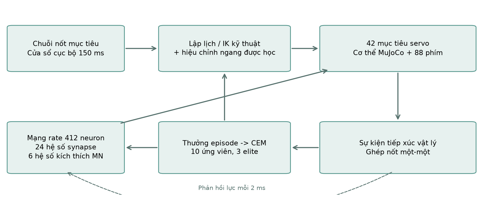
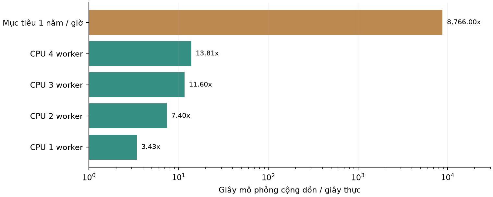
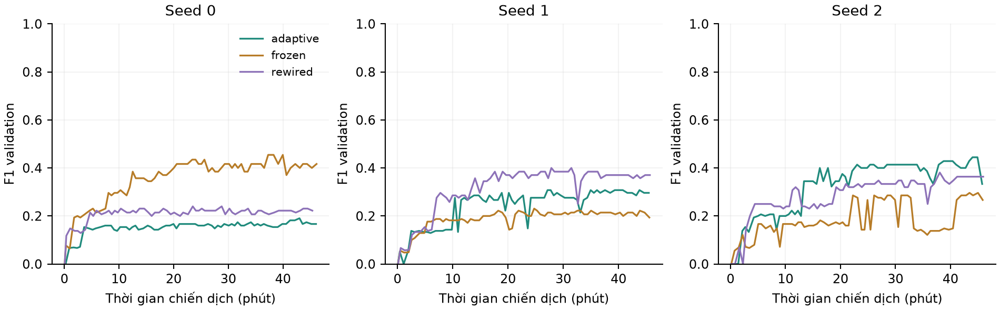
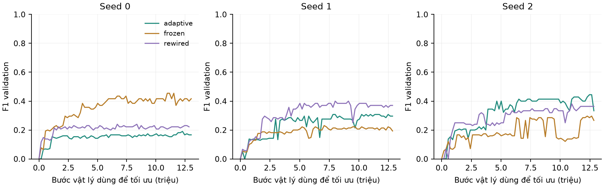
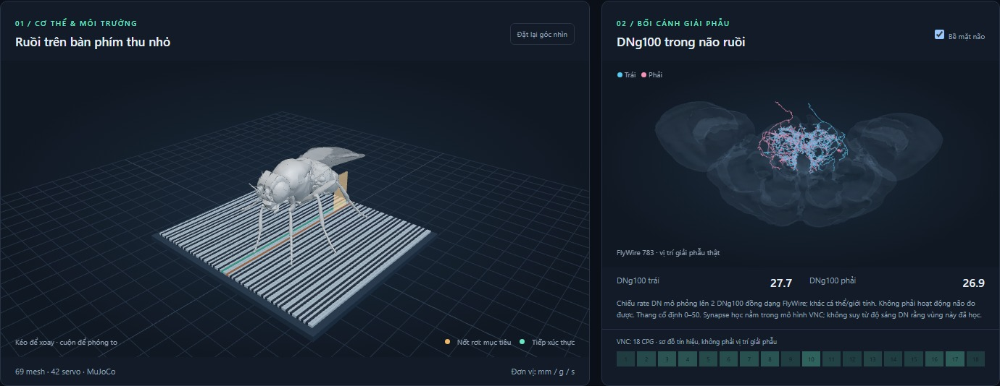

# Học điều khiển tiếp xúc phím trong một mô hình ruồi có ràng buộc connectome dưới ngân sách tính toán hữu hạn

Bản thảo nghiên cứu v4, tiếng Việt. Thí nghiệm thăm dò có phần mềm kèm theo; chưa phải bản khẳng định khả năng học của ruồi sinh học hoặc bản sẵn sàng nộp journal. Ngày khóa kết quả: 2026-09-18.

## Tóm tắt

Mô phỏng một hệ thần kinh lâu hơn không tự động tạo ra một bộ điều khiển tốt hơn. Trong tác vụ tiếp xúc phím đàn, sai lệch giữa vị trí đích hình học, mặt va chạm của chân và sự kiện phát nốt có thể giới hạn hiệu năng trước cả giới hạn học. Nghiên cứu này xây dựng một quy trình đánh giá bộ điều khiển lai gồm một mạng vận động 412 neuron có cấu trúc từ connectome, bộ giải hình học và cơ thể NeuroMechFly trên bàn phím thu nhỏ. Mục tiêu là đo hiệu năng học dưới trần một giờ tính toán, đồng thời kiểm tra cách tăng thông lượng mà giữ nguyên bước và cơ học mô phỏng.

Chúng tôi dùng gom bước MuJoCo với điều khiển giữ cố định, bốn tiến trình CPU tồn tại lâu, chương trình học từ các nốt tổng hợp và phần thưởng ghép sự kiện một-một. Trong phiên bản cuối, CEM tối ưu 49 tham số, gồm 24 hệ số synapse hiệu dụng, 6 hệ số kích thích quần thể motor neuron và 19 tham số readout. Hai đối chứng là giữ synapse cố định và hoán đổi cạnh có bảo toàn bậc, mỗi cấu hình có ba seed. Lượt v4b dùng 2786.11 giây thực, tạo 140,197,900 bước vật lý mới, trong đó 116,017,900 bước dùng để tối ưu. adaptive: F1 test trung bình 0.343; frozen: F1 test trung bình 0.330; rewired: F1 test trung bình 0.341.

Benchmark ngắn đạt RTF cộng dồn 13,807 với bốn worker, trong khi mục tiêu một năm/giờ đòi hỏi 8.766. Probe GPU bị chặn bởi tính năng noslip chưa được hỗ trợ; không thay đổi bộ giải để làm đẹp con số. Kết quả chỉ áp dụng cho họ bộ điều khiển và mô hình tiếp xúc đang xét. Không suy ra giới hạn tối đa của ruồi, khả năng đọc sheet, trí nhớ âm nhạc hay lợi ích nhân quả của connectome so với mọi kiến trúc khác.

Từ khóa: embodied control; Drosophila; connectome; tiếp xúc vật lý; derivative-free optimization; compute budget; reproducibility.

## 1. Câu hỏi và đóng góp

Câu hỏi chính: trong một trần tính toán đã xác định, một bộ điều khiển lai có tham số thần kinh thích nghi có cải thiện khả năng tạo đúng sự kiện tiếp xúc phím trên các chuỗi tổng hợp chưa dùng để tối ưu hay không? Câu hỏi hệ thống đi kèm: có thể tăng bao nhiêu thông lượng vật lý khi giữ nguyên solver, timestep và pha lấy mẫu tiếp xúc?

Ba phép đo được phân biệt: khả năng cải thiện trong quá trình tối ưu; khả năng chuyển sang các mẫu cùng phân phối nhưng khác seed; và năng lực trình diễn hai bản nhạc dài. Hai bản nhạc là bước kiểm tra ứng dụng có điều kiện, không thay thế bộ benchmark chính. Một thất bại trong giới hạn thời gian không chứng minh nhiệm vụ bất khả thi khi thay mô hình, cơ chế học hay ngân sách.

Đóng góp dự kiến là quy trình tách mục tiêu âm nhạc khỏi hành động vật lý, kế toán trải nghiệm mới, benchmark tăng tốc có kiểm tra tương đương, đối chứng cấu trúc mạng, và một app giúp kiểm tra replay cùng dữ liệu nguồn. Chưa tuyên bố một thuật toán tối ưu mới hay mô hình toàn não mới.

## 2. Nghiên cứu liên quan

NeuroMechFly v2 cung cấp một nền tảng mô phỏng cảm giác-vận động ở ruồi [1]. Mô hình whole-body fly khác đã được dùng để học các hành vi vận động phức tạp [2]. FlyGM đã khảo sát một bộ điều khiển đồ thị connectome cho cơ thể ruồi và so sánh với đồ thị hoán đổi và MLP [3]. Vì vậy, novelty của công trình này không nằm ở ý tưởng đầu tiên kết hợp connectome, học và cơ thể mô phỏng.

RoboPianist dùng mục tiêu có lookahead và phần thưởng nhấn phím, vị trí ngón cùng chi phí năng lượng; thí nghiệm báo cáo DroQ với 5 triệu mẫu cho mỗi bài và ba seed [4]. Tác vụ này khác về hình thái, số bậc tự do và mức hỗ trợ hình học, nên không dùng số đo của RoboPianist làm baseline số trực tiếp. Các nguyên tắc thiết kế thí nghiệm RL yêu cầu xem xét biến thiên theo seed, cách chọn cấu hình và chi phí đánh giá [5].

MuJoCo Python hỗ trợ nhiều bước giữ control trong một lần gọi và rollout CPU đa luồng [6]. MuJoCo Warp tập trung vào thông lượng nhiều môi trường trên GPU, nhưng tính tương đương chức năng cần được kiểm tra trên phiên bản cụ thể [7]. Kết quả tốc độ từ một mô hình nhỏ không được áp sang toàn bộ mô hình tiếp xúc ruồi-bàn phím.

## 3. Mô hình và phạm vi của việc học

### 3.1 Cơ thể, bàn phím và đơn vị

Cơ thể dựa trên FlyGym/NeuroMechFly 2.1.0; ngực cố định; có 42 position servo ở sáu chân. Cảnh vật lý gồm 214 tọa độ qpos, 214 velocity coordinates và 157 geom. Bàn phím có 88 phím tương ứng MIDI 21-108, cách tâm 0,055 mm. Mỗi phím là một khối có khớp trượt với độ cứng 5 và damping 0,006 theo đơn vị native mm, g, s; lực g.mm/s² tương ứng micro-newton. Đây là các thông số kỹ thuật giả định, không phải một đàn piano chuẩn được thu nhỏ theo luật tương tự cơ học.

Va chạm tác vụ bật giữa geom ở đầu bàn chân và phím. Chưa bao gồm tự va chạm toàn thân, cơ bắp, mỏi cơ, pedal, cơ chế búa đàn hoặc toàn bộ xúc giác. Âm thanh trong app được tổng hợp từ sự kiện tiếp xúc hoặc từ mục tiêu, và hai nguồn được người dùng chọn rõ ràng. Không dùng âm thanh mục tiêu để chấm điểm.

### 3.2 Mạng vận động và tính bất định sinh học

Đồ thị được lấy từ export MANC trong repository của Pugliese và cộng sự [8], commit 10e7661bf414ba7b4c2edf795cd36d0f878c17c0, tập W_20260522_allSynapses. Release neuPrint nền không được ghi trong export nên không tự suy là v1.2.3. Bộ lọc giữ DNg100, IN17A001, INXXX466, IN16B036 và motor neuron thuộc các phân nhóm chân. Mạng có 2 descending neuron, 18 neuron trong nhóm CPG và 392 motor neuron; 2.592 cạnh tổng hợp từ 18.831 synapse của dữ liệu đầu vào. Ma trận thưa được nhân hệ số toàn cục 0,03; chuẩn hóa thể tích tác động vào tham số gain/ngưỡng neuron. Mô hình rate dùng ngưỡng, gain, giới hạn rate và hằng số thời gian phụ thuộc giả định thể tích cùng khởi tạo theo seed; tích phân Euler ở 2 ms và trễ giả định 4 ms. Descending drive bằng 500; phản hồi lực được chuẩn hóa, chặn và chiếu vào một neuron E1 trên mỗi chân.

Mô hình full-brain có kiểm chứng hành vi của Shiu và cộng sự [9] là một phạm vi khác; v4 không kế thừa sự kiểm chứng sinh học đó. Kết quả CPG trong nghiên cứu nguồn cũng không tự xác nhận dynamics của phân đồ thị và các tham số đã chỉnh ở đây. Dấu neurotransmitter là dự đoán; v4 giữ giả định dấu đã có, chưa đánh giá bất định dấu. Không đủ dữ liệu để xem số synapse như conductance thật hoặc xem rate tính toán như firing rate đã hiệu chuẩn. Kết nối từ mục tiêu âm nhạc đến bộ lập lịch, chiếu phản hồi cảm giác, ánh xạ quần thể motor neuron sang servo đều là lựa chọn mô hình hóa. Điều này giới hạn suy luận về thần kinh học.

### 3.3 Những gì thực sự được học

Với W là ma trận có hàng biểu diễn neuron hậu synapse, phiên bản thích nghi dùng W'ij = exp(alpha_g(i)) Wij. Nhóm g(i) gồm từng neuron CPG trong 18 neuron và từng quần thể MN của sáu chân. Các hàng DN giữ hệ số 1. Alpha bị chặn trong [-0,69; 0,69]; cấu trúc zero/nonzero và dấu của cạnh không đổi. Sáu hệ số kích thích MN cộng vào phần âm của ngưỡng quần thể, trong [-50; 50] đơn vị mô hình. Đây là hệ số hiệu dụng được tối ưu ngoại tuyến, không phải luật plasticity đã được xác nhận ở ruồi.

| Khối tham số | Số lượng | Vai trò và giới hạn |
|---|---|---|
| Hệ số synapse theo nhóm | 24 | Chỉ thay biên độ dương của cạnh đã có; không thêm kết nối |
| Kích thích MN theo chân | 6 | Điều chỉnh ngưỡng; có thể tạo hoạt động nền, không diễn giải như dopamine |
| Log-gain của gate | 6 | Nhân đầu ra quần thể, sau đó chặn trong [0;1] |
| Độ mở rộng động tác ấn | 6 | Thay biên độ nội suy giữa hover và press |
| Hiệu chỉnh ngang | 6 | Dịch đích hiệu dụng tối đa ±0,275 mm; nội suy bảng IK |
| Tiến thời điểm ấn | 1 | Từ 0 đến 80 ms để bù trễ cơ học |

Tổng cộng 49 tham số ở nhánh thích nghi và hoán đổi. Nhánh giữ synapse cố định chỉ học 25 tham số còn lại; kích thích MN vẫn được học. Vì số tham số khác nhau, đây là phép ablation plasticity của synapse, chưa phải đối chứng bằng nhau về năng lực biểu diễn. Đối chứng hoán đổi mới có cùng số tham số với nhánh thích nghi.

Quan trọng về phạm vi: mạng không nhận trực tiếp tên nốt và không tự học cách đọc sheet. Bộ lập lịch nhận cao độ/thời gian và chọn chân bằng hình học; IK tạo tư thế mục tiêu, còn mạng điều biến độ ấn. Hiệu năng cuối phản ánh tổng hệ thống lai. Không được quy toàn bộ cải thiện của sáu hệ số hiệu chỉnh ngang cho khả năng nhận thức của mạng.

Hình 1. Các khối kỹ thuật, khối thần kinh có tham số thích nghi, vòng tiếp xúc vật lý và tối ưu phần thưởng. Việc cập nhật tham số xảy ra giữa các rollout, không phải học synapse trực tuyến theo từng nốt.

## 4. Tác vụ, thưởng và quy trình đánh giá

### 4.1 Từ kỹ năng cơ bản đến hai bản nhạc

Benchmark đầu tiên gồm sáu nốt không chồng lấn, lần lượt giao cho sáu chân, bắt đầu ở 0,4 s, cách nhau 0,55 s, giữ 0,22 s; tổng episode 3,72 s sau làm tròn. Mỗi chân lấy ngẫu nhiên trong ba cao độ có sai số IK nhỏ nhất của chân đó. Tập huấn luyện dùng seed tác vụ 10000 + số thế hệ; validation dùng 71001 và 71002; test dùng 91001-91004. Các seed môi trường khác nhau chủ yếu thay cao độ, chưa thay tư thế ban đầu hay thông số vật lý. Đây là kiểm tra chuyển giao hẹp trong phân phối, không phải generalization rộng.

Sau khi validation đạt precision và recall ít nhất 0,95, chương trình mở nhóm 12 cao độ reachable cho mỗi chân. Nếu test kỹ năng đạt chuẩn, một test chuỗi nhanh hơn dùng 12 nốt, khoảng cách 0,30 s và giữ 0,16 s được chạy. Chuỗi này đòi precision >0,85, recall và F1 >=0,85. Đây là ngưỡng trên ước lượng điểm của tập test nhỏ, không phải cận dưới tin cậy cho hiệu năng quần thể. Hiện curriculum chuyển sang phổ cao độ rộng hơn, nhưng không huấn luyện riêng mức chuỗi nhanh trước test; đây là bài kiểm tra transfer tốc độ khó hơn, không thể suy thất bại là mất khả năng học chuỗi.

Hai bản nhạc đầy đủ chỉ được xuất như demonstration đạt chuẩn sau khi cả hai cổng trên thành công. Merry-Go-Round of Life có 237 ô nhịp, 2.401 nốt, khoảng 316,04 s và đa âm tối đa 8; In The Pool có 69 ô viết, 73 ô khi tính lặp, 1.502 nốt, khoảng 238,46 s và đa âm tối đa 7. Các con số là từ bản OMR đang có, chưa được một nhạc công kiểm tra độc lập từng nốt. Hai bản nhạc không được dùng trong tối ưu v4. Kiểm tra cấu trúc phát hiện 1/29 nốt dư do trùng cùng pitch và onset, cùng 7/55 cặp chồng thời gian ở cùng pitch, lần lượt cho Merry/Pool. Cần xác minh unison, tie và tái nhấn rồi chuẩn hóa mục tiêu physical-key với mapping về từng voice trước khi dùng để chấm full-song. V4 giữ nguyên dữ liệu nguồn và chưa tự gộp các trường hợp chưa rõ nhạc lý.

Sáu chân không bảo đảm thực hiện mọi hợp âm hoặc với tới mọi phím. Nếu sau này trình diễn bản chuyển soạn đơn giản hơn, phải gọi đúng là bản chuyển soạn, ghi mọi nốt bị bỏ và chấm cả trên mục tiêu gốc lẫn mục tiêu chuyển soạn. Không tự đổi sang bản đơn âm để đạt chuẩn rồi gọi đó là chơi toàn bộ tác phẩm.

### 4.2 Quan sát hữu hạn và giao diện nốt rơi

Ở mỗi chân, bộ lập lịch chỉ đưa mục tiêu kế tiếp vào điều khiển khi onset còn tối đa 150 ms. App thể hiện cùng cửa sổ bằng thanh nốt rơi trên đúng phím trong cảnh 3D; đầu thanh tới bàn phím ở onset, chiều dài thể hiện phần thời gian giữ còn trong cửa sổ. Thanh là một lớp hiển thị, không có collision và không tạo lực. Replay hiển thị riêng màu mục tiêu và tiếp xúc thực. Tư thế được lưu ở 24 fps, nhưng sự kiện chấm điểm được phát hiện ở 500 Hz và lưu riêng; không chấm từ các frame video.

Tuy nhiên, ở full-song scheduler, phân công chân ban đầu được tính từ chuỗi có sẵn. Vì vậy cửa sổ 150 ms chỉ giới hạn mục tiêu vào bộ điều khiển cục bộ; chưa loại bỏ mọi lợi thế từ tiền xử lý toàn bản nhạc. Không gọi toàn bộ hệ thống là một tác nhân quan sát trực tuyến thuần túy hoặc một hệ thống nhìn và đọc bản nhạc.

### 4.3 Sự kiện nốt và phần thưởng

Lực pháp tuyến từ tiếp xúc toe-key được cộng theo phím. Onset cần lực ít nhất 0,003 micro-newton trong 16 ms; release cần dưới 0,0015 micro-newton trong 24 ms; khoảng chống lặp 40 ms. Cùng bộ phát hiện được giữ qua mọi cấu hình. Mẫu tiếp xúc lấy sau bước vật lý đầu tiên của mỗi khối 2 ms, gắn nhãn thời gian đầu khối; độ lệch quy ước 0,2 ms được giữ nhất quán, nhỏ hơn cửa sổ ghép chính 100 ms.

Chấm bằng matching một-một cùng cao độ, tối đa hóa số cặp trong ±100 ms rồi ưu tiên sai lệch nhỏ. Precision = TP/(TP+FP); recall = TP/(TP+FN); F1 là trung bình điều hòa. Không có nốt phát thì precision được quy ước 0. Mỗi mục tiêu chỉ được thưởng đúng một lần; bấm lặp hoặc bấm thêm phím không tạo thêm TP.

Reward episode = (5TP - 2FN - FP)/N + 0,5 IoU - 0,5 MAE/0,1 + 0,1D/T - min(0,1; 10^-5 E). N là số nốt mục tiêu; IoU là trung bình độ chồng lấn thời gian giữ của các cặp đã ghép; MAE chỉ tính trên cặp ghép; D tích phân độ gần đích exp(-khoảng cách/0,08 mm) trong lúc có mục tiêu; E là tích phân trị tuyệt đối công suất actuator. Thành phần shaping bị chặn, không thể một mình đạt tiêu chí thành công. Nếu có cảnh báo solver, reward bằng -10^6 và phép đánh giá có cảnh báo không được vượt cổng thành công.

IoU và MAE có tính điều kiện theo cặp được ghép, nên phải đọc cùng recall. Việc chọn hệ số 5 không phải chứng cứ về cường độ phần thưởng sinh học; nhân đồng loạt mọi hệ số không tự làm thuật toán học nhanh hơn. Chưa có reward ablation đầy đủ.

### 4.4 Tối ưu, đối chứng và tính thăm dò

CEM dùng quần thể 10, lấy 3 elite. Mean và standard deviation được trộn với tỷ trọng 0,6 cho elite mới; sigma có sàn bằng 3% bề rộng miền tham số. Mỗi thế hệ gồm mean hiện tại, checkpoint tốt nhất và các mẫu mới; các nhánh cùng seed dùng cùng chuỗi ngẫu nhiên khởi tạo và cùng seed tác vụ theo thế hệ. Chọn checkpoint theo F1 validation; reward trung bình nhân 10^-6 chỉ phá hòa. Không chọn checkpoint theo test.

Ba cấu hình: adaptive, frozen-synapses và rewired. Rewired dùng double-edge swap bảo toàn in/out degree; trọng số đi cùng nguồn, không bảo toàn incoming strength. Cả ba cùng cơ thể, scheduler, reward, detector và readout. Số seed mạng là 0, 1, 2. Các thế hệ chạy round-robin giữa chín ô, có thể khác tối đa một phần vòng cuối vì hết ngân sách. Vì vậy cần đọc cả số bước và thời gian từng ô, không chỉ gọi là ngân sách bằng nhau tuyệt đối.

Một lượt thăm dò v4a dùng 37 tham số được dừng sau khi phát hiện sai lệch giữa gốc đốt chân và mặt tiếp xúc. V4b thêm kích thích MN và hiệu chỉnh ngang, dùng bộ validation/test mới. Kết quả v4a và thời gian đã dùng được giữ lại. Quy trình này là phát triển thích nghi có khai báo, không phải tiền đăng ký độc lập hoặc phép kiểm định xác nhận. Ba seed không đủ cho suy luận quần thể vững; báo từng seed và thống kê mô tả, không dùng các nốt trong cùng seed như hàng trăm mẫu độc lập để tạo p-value nhỏ.

## 5. Tăng tốc và kế toán thời gian

Giữ MuJoCo 3.9.0, timestep 0,2 ms, neural/control timestep 2 ms, implicit-fast integrator, 50 solver iterations tối đa và noslip_iterations = 5. Trình chạy tạo một world cho mỗi worker, cache mẫu mạng, không xuất mesh JSON hoặc frame khi học. Control được giữ qua một bước, lấy mẫu, rồi gom chín bước còn lại. Kiểm tra paired scalar/batched cho cùng input có qpos cuối và các sự kiện giống hệt; đây là kiểm chứng tối ưu thực thi, chưa chứng minh hội tụ số của mô hình.

RTF_total = dt x tổng số bước vật lý mới / tổng giây thực chiến dịch. Bước train và evaluation được lưu riêng từng ô. Thời gian export replay được ghi riêng, không cộng vào trải nghiệm đã dùng để tối ưu. Warmup neuron 100 bước chỉ là 0,2 s tích phân mạng và không được tính như 0,2 s tương tác cơ thể. Các episode reset, các ứng viên CEM khác nhau và các seed khác nhau không tạo thành một quỹ đạo liên tục của một não duy nhất.

Mốc một năm/giờ đòi RTF 8.766, tức 43,83 triệu bước vật lý/giây ở dt hiện tại. Probe MuJoCo Warp 3.9.0.1 / Warp 1.17.0 trên RTX 5050 Laptop 8 GiB dừng do `noslip solver not implemented`. Không có số thông lượng GPU hợp lệ cho mô hình này. Tắt noslip, đổi collider, giảm iteration hoặc tăng dt cần một nghiên cứu hiệu chuẩn riêng.

Hình 2. Thông lượng benchmark CPU gồm tiếp xúc chủ động, sau warmup worker. Cột mục tiêu một năm/giờ chỉ là yêu cầu toán học; trục log tránh che mất khoảng cách lớn. Benchmark này được chạy trước hiệu chỉnh v4b; thông lượng chiến dịch cuối được báo riêng.

## 6. Kết quả

### 6.1 Ngân sách và lượng trải nghiệm

Lượt v4a 20260918T055453 dừng sau 432.30 s. Lượt v4b 20260918T060329 có trần 3.150 s, bắt đầu với protocol đã sửa và chia 88% ngân sách cho tối ưu. Tổng thực tế hai lượt là 3218.41 s, nằm trong trần 3.600 s. V4b có 116,017,900 bước tối ưu và 24,180,000 bước đánh giá; RTF toàn chiến dịch v4b là 10.064. Tổng giây mô phỏng không phải thời gian học của một bộ não duy nhất. Benchmark, phát triển phần mềm và xuất video/replay không nằm trong ngân sách learner này.

| Giai đoạn | Giây thực | Giây mô phỏng mới |
|---|---|---|
| V4a thăm dò, 37 tham số | 432.30 | 5379.12 |
| V4b, 49 tham số | 2786.11 | 28039.58 |
| Tổng hai lượt | 3218.41 | 33418.70 |

### 6.2 Học và chuyển giao trong phân phối

adaptive: F1 test trung bình 0.343; frozen: F1 test trung bình 0.330; rewired: F1 test trung bình 0.341. Số thế hệ hoàn tất theo ô nằm trong [69, 70]. Đường validation có dao động; checkpoint cuối được chọn bằng validation, không phải điểm cuối đường học. Không sử dụng khác biệt trung bình của ba seed làm chứng cứ ưu thế có ý nghĩa thống kê.

| Mốc thực (phút) | Seed | P trung bình | R trung bình | F1 trung bình | F1 min-max | Trễ tối đa (s) |
|---|---|---|---|---|---|---|
| 5 | 3 | 0.137 | 0.194 | 0.160 | 0.133-0.200 | 28.6 |
| 15 | 3 | 0.226 | 0.306 | 0.260 | 0.148-0.345 | 34.0 |
| 30 | 3 | 0.257 | 0.333 | 0.289 | 0.167-0.414 | 44.8 |
| 45 | 3 | 0.283 | 0.333 | 0.305 | 0.174-0.444 | 41.9 |

Các mốc dùng điểm validation gần nhất không vượt mốc, trung bình trên ba seed adaptive; cột trễ cho biết độ cũ lớn nhất của điểm đo. Đây không phải test lặp lại sau mỗi mốc.

Hình 3. F1 validation theo thời gian thực chiến dịch, từng seed ở một panel. Đây là điểm validation mỗi thế hệ, không phải đường test. Việc lặp lại cùng tập validation nhỏ có thể gây overfit chọn mô hình.

| Mạng / seed | Train phút mô phỏng | Precision | Recall | F1 | TP / mục tiêu | Warning |
|---|---|---|---|---|---|---|
| adaptive / 0 | 43.40 | 0.353 | 0.250 | 0.293 | 6 / 24 | 0 |
| frozen / 0 | 43.40 | 0.450 | 0.375 | 0.409 | 9 / 24 | 0 |
| rewired / 0 | 43.25 | 0.304 | 0.292 | 0.298 | 7 / 24 | 0 |
| adaptive / 1 | 42.78 | 0.259 | 0.292 | 0.275 | 7 / 24 | 0 |
| frozen / 1 | 42.78 | 0.257 | 0.375 | 0.305 | 9 / 24 | 0 |
| rewired / 1 | 42.78 | 0.367 | 0.458 | 0.407 | 11 / 24 | 0 |
| adaptive / 2 | 42.78 | 0.429 | 0.500 | 0.462 | 12 / 24 | 0 |
| frozen / 2 | 42.78 | 0.259 | 0.292 | 0.275 | 7 / 24 | 0 |
| rewired / 2 | 42.78 | 0.350 | 0.292 | 0.318 | 7 / 24 | 0 |

Hình 4. F1 validation theo số bước vật lý dùng để tối ưu từng ô; không gồm các bước đánh giá. Biểu đồ giúp phân biệt lợi ích tốc độ thực thi với lợi ích hiệu quả mẫu; chưa thực hiện một phép kiểm định ưu thế thống kê.

### 6.3 Demonstration và cổng chất lượng

Có 0/9 ô vượt đồng thời cổng kỹ năng và chuỗi. Chính sách primary cố định trước là adaptive seed 0. Primary chưa vượt cả hai cổng nên hai bài nhạc đầy đủ bị khóa ở v4. App cung cấp replay kỹ năng để chẩn đoán, không trình bày nó như một buổi biểu diễn thành công. Dữ liệu hai bản nhạc vẫn được giữ nguyên để đánh giá sau. Replay chẩn đoán cố định có 6 nốt, P=0.667, R=0.333, F1=0.444; nó chỉ là một trong các đoạn test, không thay thế kết quả 24 nốt ở bảng trên.

Hình 5. App v4 ở thời điểm cố định 1,05 s của replay kỹ năng, adaptive seed 0. Thanh nốt và tiếp xúc được tách màu; morphology não và tín hiệu CPG được ghi rõ phạm vi. Đây là hình chẩn đoán, không phải chứng cứ đã chơi thành công hai bản nhạc.

App có replay chân/phím và 2 neuron DNg100 trong bề mặt não 3D. Màu rate DN được chiếu từ mạng MANC lên neuron đồng dạng của FlyWire, khác cá thể và giới tính. Các neuron thật trong mô hình học chủ yếu thuộc VNC; độ sáng DN trên brain viewer không biểu diễn toàn bộ plasticity đã học. Không gọi vùng sáng là một phép đo calcium imaging hoặc bằng chứng nhân quả về vùng não chịu trách nhiệm.

## 7. Diễn giải và giới hạn

Giới hạn cơ học: các phím rộng xấp xỉ bề ngang bàn chân, nên một chân có thể chạm nhiều phím. Sai số IK tính ở gốc đốt chân có thể nhỏ dù vị trí mặt va chạm sai. Hiệu chỉnh ngang là một phép bù được học, chưa thay thế inverse contact kinematics dựa trên mặt hỗ trợ thật. Hình thái này đặt một bài toán contact-rich khó ngay cả với một bộ điều khiển kỹ thuật tốt.

Giới hạn nhận dạng thần kinh: 24 hệ số synapse là tham số theo nhóm, không phải 2.592 synapse độc lập. Kích thích MN và readout có thể bù cấu trúc mạng, làm giảm khả năng quy kết cải thiện cho topology. Cần ablation khóa readout, khóa kích thích, tắt mạng và MLP/RNN có ngân sách tương ứng. Thay đổi topology có thể thay đổi incoming strength; cần thêm null model bảo toàn đặc điểm phù hợp với giả thuyết.

Giới hạn tác vụ: sáu nốt chậm với tập cao độ nhỏ và tư thế reset cố định chưa đủ đại diện cho hai tác phẩm dài, hợp âm, quãng lớn và thay đổi tempo. Trình diễn âm nhạc yêu cầu dữ liệu nốt được xác minh, đánh giá pedal/duration khi có và công bố các trường hợp không thể thực hiện với sáu chân. Không chấm precision cao bằng cách bỏ nốt khó khỏi mẫu số.

Giới hạn thực nghiệm: ba seed, một máy và một thuật toán tìm kiếm; tập validation chỉ 12 nốt và test kỹ năng 24 nốt mỗi seed. Chưa thử độ nhạy theo reward, thời gian trễ, contact threshold, timestep hay nhiễu cơ học một cách có hệ thống. Chưa chứng minh hội tụ số hoặc tính tương đương CPU-GPU. Một giờ là trần thăm dò có ý nghĩa kỹ thuật, không phải ngân sách đủ để chốt giới hạn học của mô hình.

Khả năng hướng đến journal Q2 phụ thuộc đóng góp, mức phù hợp chuyên ngành và bằng chứng bổ sung. V4 hiện phù hợp như bản thảo phương pháp/thăm dò và phần mềm kiểm chứng. Để nộp như một bài nghiên cứu hoàn chỉnh cần một kết quả cơ chế hoặc benchmark rõ ràng, baseline mạnh, kiểm định cơ học, lặp độc lập và khả năng tái lập dữ liệu. Không thể bảo đảm acceptance bằng cách đổi cách diễn đạt hoặc loại các câu hỏi của reviewer.

## 8. Kết luận

V4 triển khai tăng tốc CPU có kiểm tra tương đương và một pipeline học/đánh giá có ngân sách. adaptive: F1 test trung bình 0.343; frozen: F1 test trung bình 0.330; rewired: F1 test trung bình 0.341. Mục tiêu một năm mô phỏng trong một giờ chưa đạt; probe GPU không tương thích noslip. Kết quả là đánh giá của một bộ điều khiển lai có hỗ trợ hình học trong phạm vi synthetic hẹp. Cần sửa/kiểm chứng cơ học tiếp xúc và bổ sung baseline, test chuyển giao trước khi đưa ra kết luận rộng hơn.

Không có cơ sở kết luận ruồi sinh học không thể học piano, và không dùng nhận xét hài hước về việc thay thế nghệ sĩ như một kết luận khoa học. Nếu muốn một câu nhẹ nhàng trong discussion, cách diễn đạt có phạm vi là: "Với mô hình và ngân sách đã thử ở đây, người chơi piano vẫn chưa cần lo về đối thủ sáu chân." Câu này không thay cho dữ liệu hoặc một kiểm định về khả năng của động vật thật.

## Khả dụng dữ liệu, phần mềm và trách nhiệm

Mã v4, định nghĩa reward, detector, cấu hình, checksum nguồn, benchmark và kết quả tổng hợp được lưu trong repository dự án. Mã v3 và kết quả v3 được giữ nguyên. Sheet/MIDI, replay lớn và graph input có điều kiện giấy phép không được tự động phát hành công khai. Asset NeuroMechFly, Three.js và FlyWire được giữ nguồn/giấy phép trong bundle riêng. Chưa xác nhận đầy đủ quyền tái phân phối export connectome; do đó chưa tuyên bố toàn bộ pipeline có thể tái lập chỉ bằng một clone công khai.

Mỗi lượt lưu run_id, các phiên bản thư viện, checksum các file mô hình/thuật toán chính, seed, ngân sách và kết quả từng ô. Trạng thái phần cứng: Ryzen AI 5 340, 6 core/12 thread; RTX 5050 Laptop 8 GiB. Hiệu năng phụ thuộc nhiệt và phần mềm nền. Không có thí nghiệm động vật sống trong quy trình này.

## Tài liệu tham khảo

[1] [NeuroMechFly v2, Nature Methods, 2024](https://www.nature.com/articles/s41592-024-02497-y).

[2] [Whole-body physics simulation of fruit fly behavior, Nature, 2025](https://www.nature.com/articles/s41586-025-09029-4).

[3] [Jin và cộng sự. Whole-Brain Connectomic Graph Model Enables Whole-Body Locomotion Control in Fruit Fly. arXiv:2602.17997, 2026, preprint](https://arxiv.org/abs/2602.17997).

[4] [Zakka và cộng sự. RoboPianist: Dexterous Piano Playing with Deep Reinforcement Learning. PMLR 229, 2024](https://proceedings.mlr.press/v229/zakka23a.html).

[5] [Empirical Design in Reinforcement Learning. JMLR 25, 2024](https://jmlr.org/papers/v25/23-0183.html).

[6] [MuJoCo Python documentation, phiên bản 3.9.0](https://mujoco.readthedocs.io/en/3.9.0/python.html).

[7] [MuJoCo Warp documentation](https://mujoco.readthedocs.io/en/stable/mjwarp/index.html) và [repository chính thức](https://github.com/google-deepmind/mujoco_warp).

[8] [Pugliese và cộng sự. Connectome simulations identify a central pattern generator circuit for fly walking. bioRxiv, 2025, preprint](https://doi.org/10.1101/2025.09.12.675944). [Code/data repository](https://github.com/smpuglie/Pugliese_cpg_2025).

[9] [Shiu và cộng sự. A Drosophila computational brain model reveals sensorimotor processing. Nature 634, 210-219, 2024](https://www.nature.com/articles/s41586-024-07763-9).
