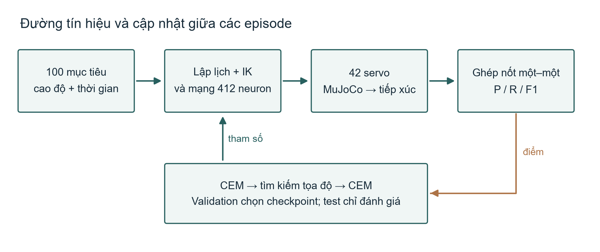
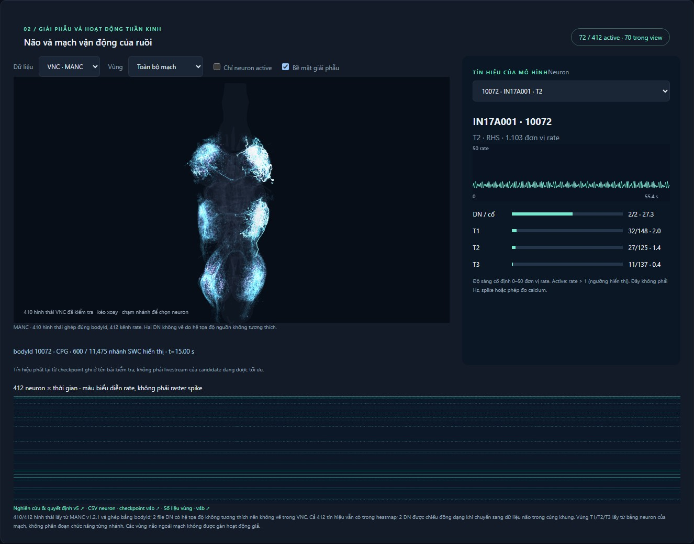

# Học điều khiển tiếp xúc có ràng buộc connectome trên mô hình ruồi: đánh giá 100 nốt và minh họa hai bản piano

Bản v5 · Bản thảo phương pháp và kết quả chẩn đoán · 18/09/2026

## Tóm tắt

Bản đồ connectome mô tả dây nối thần kinh, nhưng không cung cấp trực tiếp một chính sách điều khiển cho tác vụ mới. Nghiên cứu này khảo sát một bộ điều khiển lai gồm mạch vận động 412 neuron, mô hình cơ thể NeuroMechFly và bàn phím thu nhỏ trong MuJoCo. Bộ lập lịch nhận chuỗi cao độ–thời gian, động học nghịch tạo tư thế chân, còn mạng thần kinh điều biến độ ấn. V5 mở rộng phép thử lên 100 sự kiện nốt mỗi episode, lưu hoạt động từng neuron và bổ sung tìm kiếm thích nghi khi quá trình tối ưu chững lại. Mục tiêu vận hành là precision ít nhất 80% đồng thời recall ít nhất 60%; hai ngưỡng này là tiêu chí cần kiểm tra, chưa phải kết quả đạt được. Trên chuỗi chẩn đoán cũ gồm 100 nốt, checkpoint chuyển từ v4b khớp 17 nốt trong 54 lần bấm: precision 31,48%, recall 17% và F1 22,08%. Các phép thử riêng trên cùng một chuỗi hiệu chuẩn cho thấy ép gate tối đa hoặc thay điểm đích IK bằng điểm thấp nhất của mesh chưa cải thiện tiếp xúc. Vì chưa có teacher cơ học đáng tin cậy, phiên bản hiện tại dùng CEM kết hợp tìm kiếm tọa độ, chưa triển khai imitation learning. Hai bản piano được dùng để đánh giá trong dữ liệu đã luyện và minh họa hoạt động; chúng không chứng minh khả năng khái quát hóa hoặc hoạt động của toàn bộ não ruồi.

Từ khóa: connectome; điều khiển vận động; NeuroMechFly; tiếp xúc; học từ phần thưởng; tái lập.

## 1. Câu hỏi nghiên cứu và phạm vi kết luận

Câu hỏi của v5 là: với bộ lập lịch, cơ thể, cách chấm nốt và ngân sách cố định, tối ưu các hệ số của một mạch vận động có tăng khả năng tạo tiếp xúc đúng cao độ và đúng thời điểm hay không? Câu hỏi này hẹp hơn việc một con ruồi có biết đọc nhạc hoặc chơi piano. Đầu vào là sự kiện nốt đã được xử lý, không phải ảnh bản nhạc. Mô hình không phải toàn não, không có mô phỏng trí nhớ một tác phẩm, tuổi thọ, ăn uống hoặc ngủ nghỉ.

Mục tiêu precision 80% được chọn theo yêu cầu đánh giá của dự án. Recall tối thiểu 60% ngăn tình huống chỉ bấm vài nốt thuận lợi rồi báo precision cao. Đạt hai ngưỡng trong mô phỏng sẽ là một mốc kỹ thuật của hệ lai. Nó không tự xác lập tính đúng sinh học của động lực học neuron hoặc lợi thế của connectome trước một kiến trúc khác.

V4 đã khóa thí nghiệm so sánh ba cấu hình và ba seed. V5 thay protocol tác vụ và tối ưu nên được báo cáo riêng; kết quả 6 nốt mỗi episode, 24 nốt test mỗi ô của v4 không được đổi tên thành kết quả 100 nốt. Đợt dài mới gồm kỹ năng và hai bài nhạc chưa có kết quả cuối tại thời điểm khóa nội dung bản thảo này. Các bảng dưới đây chỉ chứa phép đo đã hoàn tất.

## 2. Cơ sở nghiên cứu và lựa chọn phương pháp

FlyWire công bố connectome não ruồi cái trưởng thành năm 2024 [1]. BANC năm 2026 nối phạm vi nghiên cứu sang não và dây thần kinh bụng trong cùng mẫu [2]. Cấu trúc này mở rộng khả năng đặt giả thuyết về mạch cảm giác–vận động, nhưng không tự xác định các tham số sinh lý, đầu vào tác vụ hay cách ghép mạng vào cơ thể. Trong dự án hiện tại, hình thái MANC và FlyWire đến từ những cá thể khác nhau. Việc hiển thị chung một giao diện không phải đăng ký giải phẫu thành cùng một hệ thần kinh.

FlyGM v3 mô tả học bắt chước quỹ đạo chuyên gia rồi tinh chỉnh bằng PPO cho vận động cơ thể ruồi [3]. FLYNN dùng DAgger với bộ lập kế hoạch VFH* và PID có thông tin đặc quyền để dạy mạng theo topology não ruồi trong điều hướng robot [4]. Hai kết quả gợi ý một thứ tự triển khai: xác minh bộ điều khiển mẫu, thu quỹ đạo hành động, rồi mới học chính sách. Chúng không cho phép lấy trực tiếp mức thành công locomotion/navigation làm dự đoán precision piano.

V5 chưa có teacher tiếp xúc đạt yêu cầu. Vì vậy, hướng được triển khai trước là phối hợp tìm kiếm toàn cục với hiệu chỉnh cục bộ khi plateau, lấy cảm hứng từ ENOMAD [5]. CEM và tìm kiếm tọa độ ở đây không phải thuật toán MADS của công trình đó. CANTABILE, preprint nộp ngày 16/09/2026, cho thấy cần gắn thưởng biểu diễn với độ phủ onset để tránh bỏ nốt khó [6]; v5 sử dụng nguyên tắc kiểm soát độ phủ, chưa mô phỏng cường độ âm nhạc theo MIDI velocity.

Không có cơ sở để đồng nhất tăng hệ số reward trong máy tính với tăng dopamine sinh học. Saito và cộng sự cho thấy các autoreceptor dopamine có thể khuếch đại hoặc làm giảm tín hiệu thưởng tùy cường độ trong thí nghiệm của họ [7]. Do đó, reward của v5 được mô tả bằng công thức tối ưu hành vi, không được gọi là mô hình dopamine. Các kết luận về lợi ích topology cũng cần đối chứng chặt chẽ về khởi tạo và mạng hoán đổi; một preprint năm 2026 cho thấy những lựa chọn này có thể đảo chiều cách diễn giải ưu thế connectome [8].

## 3. Mô hình và phép đo

### 3.1 Cơ thể, mạng và đường điều khiển

Cơ thể dùng asset NeuroMechFly/FlyGym 2.1.0, có 42 servo vị trí và ngực cố định. Bàn phím gồm 88 bề mặt cảm biến tiếp xúc được thiết kế cho mô phỏng; khoảng cách phím là 0,055 mm. Đây không phải cơ cấu đàn piano tiêu chuẩn. Chỉ va chạm đầu bàn chân–phím được dùng cho tác vụ, chưa có tự va chạm toàn thân, mô hình cơ bắp hoặc pedal. Vật lý dùng MuJoCo 3.9.0, bước 0,2 ms; mạng cập nhật mỗi 2 ms.

Mạch có 2 neuron đường xuống, 18 neuron CPG và 392 motor neuron. 55 tham số gồm 24 hệ số synapse theo nhóm, 6 hệ số gate, 6 hệ số độ ấn, 6 độ lệch ngưỡng MN, 6 độ lệch ngang, 1 thời gian nhấn sớm và 6 gain tín hiệu mục tiêu vào E1. Hệ số synapse dương giữ dấu và cấu trúc cạnh ban đầu. Việc tối ưu đồng thời phần thần kinh và decoder tạo khả năng bù trừ giữa các nhóm tham số; cải thiện điểm tổng không tự chứng minh mạng đã học một cơ chế sinh học riêng.

Hình 1. Nốt mục tiêu được cung cấp trước tối đa 150 ms. Đường score–IK là hỗ trợ kỹ thuật; mạng điều biến độ ấn. Bộ chấm nhận sự kiện tiếp xúc từ MuJoCo. Điểm validation chọn checkpoint cho episode tiếp theo, không tạo nốt đúng trong replay. Sơ đồ là ảnh PNG cố định.

### 3.2 Ghép sự kiện và mẫu số

Một nốt chỉ được tính đúng khi cao độ trùng và onset sai khác không quá 100 ms, ghép một–một giữa mục tiêu và tiếp xúc. Detector giữ ngưỡng bật 0,003 µN trong 16 ms, ngưỡng tắt 0,0015 µN trong 24 ms và refractory 40 ms. Các ngưỡng này không được nới khi kết quả thấp. Thời gian giữ nốt được lưu riêng, nhưng tiêu chí P80/R60 hiện chỉ dựa trên cao độ và onset.

Precision P = TP/A, recall R = TP/N, F1 = 2PR/(P+R), với N là số mục tiêu, A là số lần bấm thực và TP là số cặp khớp. Khi không có lần bấm, P được quy ước bằng 0. Với 100 mục tiêu, mỗi nốt khớp làm recall tăng một điểm phần trăm; precision không có mẫu số cố định 100. Việc dùng 100 nốt cũng không có nghĩa sai số ước lượng chỉ là 1%.

### 3.3 Chuỗi kỹ năng và hai tác phẩm

Mỗi chuỗi kỹ năng có đúng 100 sự kiện, luân phiên sáu chân, thời gian cách onset 0,55 s và thời gian giữ mục tiêu 0,22 s. Mức dễ dùng ba cao độ có sai số IK nhỏ nhất mỗi chân; mức mở rộng dùng 12. Phạm vi này vẫn ưu tiên khả năng với của mô hình, không đại diện đồng đều cho 88 phím. Tập cao độ được quyết định bằng sai số IK, chưa phải bằng tiếp xúc thực.

Merry-Go-Round of Life có 2.401 sự kiện và thời lượng mục tiêu 316,04 s; In The Pool có 1.502 sự kiện và 238,46 s. Các sự kiện xuất phát từ OMR sheet do người dùng cung cấp và chưa được một người chép nhạc độc lập kiểm tra từng nốt. Mỗi episode bài nhạc lấy đúng 100 sự kiện liên tiếp. Block cuối có thể chồng lấn và ranh giới có thể cắt hợp âm; cả hai hạn chế được giữ trong log. Toàn bài được chấm riêng trên toàn bộ sự kiện, gồm nốt trùng và nốt không thể gán chân. Không xóa nốt khó khỏi mẫu số.

## 4. Quy trình học và xử lý plateau

### 4.1 Điểm tối ưu và checkpoint

Điểm chọn checkpoint là J = P + 0,5F1 − 2 max(0; 0,6 − R). Đây là một thiết kế thực dụng để cân bằng precision và độ phủ, chưa phải một reward đã được xác nhận tối ưu. Khi xếp hạng candidate trong episode luyện, thêm 0,01 tanh(reward v4) để cung cấp tín hiệu shaping nhỏ; validation không dùng phần cộng này. Candidate có cảnh báo solver không được chọn. CEM dùng 8 candidate, 3 elite và làm trơn mean/sigma; phương sai có sàn để tránh co về 0.

Kỹ năng có hai chuỗi validation riêng, seed 83001 và 83002, mỗi chuỗi 100 nốt ở mức mở rộng. Chúng được dùng nhiều lần để chọn checkpoint nên không phải test. Ba chuỗi seed 94001, 94002 và 94003 chỉ chạy sau khi khóa checkpoint, tổng 300 mục tiêu. Mục tiêu cuối được xét trên số đếm gộp của ba chuỗi: P ≥0,8, R ≥0,6 và không có cảnh báo solver. Replay kỹ năng chỉ thể hiện chuỗi test thứ nhất; điểm của replay không được thay thế điểm test gộp.

Các khoảng Wilson 95% của P và R được lưu để biểu diễn độ bất định theo số đếm. Các nốt trong một episode có phụ thuộc thời gian, nên khoảng này chỉ là mô tả và có thể quá hẹp. Một seed tối ưu chưa đủ suy luận độ ổn định giữa các lần huấn luyện; cần nhiều seed và bootstrap theo episode cho nghiên cứu xác nhận.

### 4.2 Curriculum, plateau và ngân sách

Trong 25% đầu của thời gian tối ưu kỹ năng, chuỗi luyện dùng mức dễ; phần còn lại dùng mức mở rộng. Validation/test luôn giữ mức mở rộng để điểm trước–sau có cùng định nghĩa. Sau kỹ năng, hai nhánh Merry và Pool khởi tạo độc lập từ cùng checkpoint kỹ năng. Các đoạn validation của từng bài có thể đã được luyện; chúng chỉ đo hiệu năng trong bài, không đo chuyển giao sang tác phẩm mới.

CEM kiểm tra validation mỗi năm thế hệ. Bốn lần kiểm tra liên tiếp không tăng J quá 0,005 được xem là plateau. Chương trình chuyển sang tìm kiếm tọa độ theo cặp cộng/trừ quanh checkpoint tốt nhất, tập trung vào các tham số từ gate đến cue. Mỗi lô cục bộ được validation; nếu tiếp tục bốn lần không cải thiện, chương trình khởi động lại CEM với sigma bằng 22% khoảng tham số. Checkpoint tốt nhất được giữ qua mọi lần chuyển. Hai chế độ có tần suất validation khác nhau, vì thế mọi so sánh hiệu quả phải tính cả thời gian đánh giá.

Ngân sách tối đa là 60 phút kỹ năng, 120 phút Merry và 120 phút Pool. Khoảng 85% mỗi giai đoạn dành cho tối ưu và validation; phần còn lại dành cho test/replay. Vượt ngưỡng không phải điều kiện để mở minh họa, và hết ngân sách không được ghi thành đạt ngưỡng. Nếu thiếu thời gian xuất replay hoặc test, trạng thái ghi rõ chưa hoàn tất. Thời gian mô phỏng là tổng số bước vật lý nhân 0,2 ms qua các rollout; đây là tổng trải nghiệm của nhiều bản sao, không phải tuổi của một con ruồi.

### 4.3 Dừng và tiếp tục

Sau mỗi thế hệ hoàn tất, chương trình lưu nguyên tử tham số, mean/sigma, trạng thái RNG, chế độ tìm kiếm, generation, lịch sử và thời gian đã tiêu thụ. Nút dừng hủy rollout đang chạy rồi lưu checkpoint. Lần chạy tiếp dùng ngân sách còn lại; thời gian ứng dụng đóng không tính là thời gian học. Khi tiến trình bị đóng đột ngột, công việc chưa checkpoint có thể phải chạy lại và thời gian chưa lưu không thể khôi phục chính xác. Đây không phải bảo đảm resume bit-for-bit của toàn bộ tiến trình.

## 5. Kết quả chẩn đoán đã hoàn tất

### 5.1 Checkpoint chuyển từ v4b

Chuỗi seed 91001 ở mức dễ, dài 55,42 s mô phỏng, có 17 nốt khớp, 83 nốt thiếu và 37 lần bấm thừa. P =31,48%, R =17,00%, F1 =22,08%. Tăng đồng loạt cue E1 từ 0 lên 10 hoặc 30 không đổi các số đếm trong phép thử này. Kết quả âm tính cho thấy chưa thể coi riêng đường cue bổ sung là cải tiến học; nó không chứng minh cue vô dụng trên mọi tham số hoặc tác vụ.

### 5.2 Phân biệt nút thắt mạng với tiếp xúc

Một phép thử hiệu chuẩn khác giữ nguyên 100 mục tiêu seed 82001. Điều kiện gate cưỡng bức thay đầu ra mạng bằng một hằng số để chẩn đoán decoder. Điều kiện IK tiếp xúc nhắm điểm thấp nhất của mesh chân thay vì gốc đốt; hình học phím, mesh, servo và detector không đổi. Các điều kiện này không phải teacher đã tối ưu và không phải upper bound của cơ thể.

| Điều kiện, seed 82001 | Khớp / lần bấm | P / R / F1 (%) |
|---|---|---|
| Decoder cũ, checkpoint v4b | 17 / 70 | 24,29 / 17,00 / 20,00 |
| Decoder cũ, gate = 1, cùng checkpoint | 17 / 126 | 13,49 / 17,00 / 15,04 |
| IK điểm tiếp xúc, cùng checkpoint | 17 / 126 | 13,49 / 17,00 / 15,04 |
| IK điểm tiếp xúc, gate = 1 | 17 / 184 | 9,24 / 17,00 / 11,97 |

Không điều kiện nào ở bảng này có cảnh báo solver. Tuy nhiên, không có cảnh báo chỉ loại được một loại lỗi số; nó không xác nhận tính đúng của mô hình sinh cơ học. Thử nghiệm IK mới làm tăng bấm thừa và chưa tăng số nốt khớp nên bị loại khỏi bản chạy chính. Hai bộ kết quả seed 82001 và 91001 không được so như trước–sau của cùng chuỗi.

Đợt kỹ năng → hai bài với quy tắc plateau mới là thí nghiệm tiếp theo, chưa nằm trong bảng kết quả đã khóa. Bản thảo không điền trước điểm 80%, không dùng điểm validation thay test và không đưa một lần chạy dài thành bằng chứng nhân quả cho ưu thế connectome.

## 6. Minh họa hoạt động và truy xuất neuron

Giao diện dùng một khung giải phẫu với lựa chọn dữ liệu não FlyWire hoặc VNC MANC, chung thời gian replay, chọn neuron, trace và heatmap. 412 bodyId và cell type đã được đối chiếu với metadata nguồn. Có 410 hình thái VNC tương thích tọa độ; hai SWC DN không tương thích nên không được vẽ vào VNC bằng căn chỉnh thủ công. Ở chế độ não, hai neuron DNg100 đồng dạng được ghép bằng MANC ID và nhận tín hiệu của hai DN mô hình. Các vùng ngoài mạch không được gán hoạt động giả.

Hình 2. Khung giải phẫu thống nhất ở chế độ VNC, replay chẩn đoán cũ tại 15 s. Các nhánh là đoạn SWC thật; tối đa 600 cạnh được giữ cho mỗi neuron để hiển thị. Heatmap chứa đủ 412 tín hiệu. Đây là ảnh xem lại checkpoint v4b, không phải kết quả của đợt tối ưu mới.

Độ sáng lấy trực tiếp từ rate được lưu trong replay, dùng cùng thang 0–50 và ngưỡng hiển thị active >1. Đơn vị này không phải Hz, spike hoặc calcium. Replay là dữ liệu đã ghi của checkpoint có tên; nó không phải livestream của candidate đang luyện. Tín hiệu DN nhận drive ngoài liên tục, nên việc DN sáng không tự chứng minh có học hoặc có xử lý âm nhạc. Audio mục tiêu và audio từ tiếp xúc được tách rõ; chỉ tiếp xúc tạo điểm.

## 7. Giới hạn, đối chứng cần thêm và phương án dự phòng

Nút thắt đầu tiên là teacher cơ học. Gốc đốt chân, mặt va chạm và trạng thái khớp động không hoàn toàn trùng nhau. Hiệu chuẩn tốt hơn cần lập bản đồ tiếp xúc thực theo chân/cao độ, kiểm tra các nốt không dùng để hiệu chuẩn và đo sai lệch khi đổi tốc độ. Chỉ sau khi teacher đạt yêu cầu mới nên thu quỹ đạo để imitation hoặc DAgger. Nếu teacher vẫn không đạt, phạm vi phù hợp là nghiên cứu hiệu chuẩn tiếp xúc, không phải giới hạn năng lực học của não ruồi.

Nút thắt thứ hai là khả năng nhận dạng đóng góp của mạng. Cần các nhánh decoder-only, synapse cố định, mạng hoán đổi giữ bậc và mạng không connectome với số tham số, khởi tạo, dữ liệu và ngân sách tương ứng. Ablation phải lần lượt khóa nhóm synapse, ngưỡng MN, gate và lateral bias. Nếu những nhóm kỹ thuật giải thích phần lớn cải thiện, kết luận cần nêu điều đó thay vì quy cho cấu trúc thần kinh.

Nút thắt thứ ba là thống kê và khái quát hóa. Một seed cùng ba chuỗi test gần phân phối luyện chưa đủ cho suy luận rộng. Nghiên cứu xác nhận cần nhiều seed, chuỗi chưa gặp về thứ tự/tempo, khoảng với, hợp âm và nhiễu cơ học, cùng phân tích độ nhạy của detector và bước thời gian. Hai bài đã luyện là minh họa trong phân phối. Sheet phải được kiểm tra từng nốt trước khi dùng làm chuẩn biểu diễn âm nhạc.

Nếu quá trình dài vẫn plateau, phương án dự phòng là giữ checkpoint tốt nhất, kết thúc đúng ngân sách và báo cáo chưa đạt P80/R60. Đổi sang một mạng lớn hoặc whole-brain model chỉ hợp lý sau khi kiểm chứng teacher và đối chứng decoder; tăng số neuron tự nó không sửa lỗi tiếp xúc. Chuyển sang BANC cùng cá thể có thể giảm bất định đăng ký giải phẫu, nhưng đòi hỏi xây lại đường vào/ra và kiểm chứng động lực học, không phải chỉ thay asset 3D.

Với bằng chứng hiện tại, đây là bản thảo phương pháp và chẩn đoán, chưa đủ để bảo đảm khả năng nhận ở một tạp chí Q2. Yêu cầu cần hoàn thành trước khi nộp là kết quả nhiều seed với đối chứng công bằng, chuẩn nốt đã kiểm tra, thí nghiệm độ nhạy và dữ liệu tái lập. Xếp hạng tạp chí không thay thế các tiêu chí đó.

## 8. Kết luận

V5 đặt việc học của bộ điều khiển lai vào một phép đo rõ hơn: 100 mục tiêu mỗi episode, precision đi kèm recall, test tách khỏi chọn checkpoint và cơ chế đổi thuật toán khi plateau. Giao diện cho phép truy từ hình thái neuron đến đúng kênh hoạt động đã lưu. Kết quả đã hoàn tất cho thấy chưa đạt mục tiêu và chưa có teacher cơ học đủ tốt để triển khai imitation đáng tin cậy. Những kết quả này định vị công việc tiếp theo ở hiệu chuẩn tiếp xúc và đối chứng đóng góp của mạng, không cho phép kết luận một con ruồi sinh học có hoặc không có khả năng chơi piano.

## Dữ liệu và phần mềm

Mã nguồn, protocol, thông số, checksum, bảng kết quả probe và tài liệu nghiên cứu nằm trong thư mục v5 của repository. Input connectome, morphology, sheet có quyền sử dụng riêng và replay lớn được giữ ngoài commit khi cần. Checkpoint chiến dịch có run_id, hash nguồn, seed và ngân sách. Bản v4 giữ số liệu đã khóa; các thay đổi biên tập không thay thế evidence hoặc đường học cũ. Không có thí nghiệm động vật sống trong nghiên cứu này.

## Tài liệu tham khảo

[1] [Dorkenwald và cộng sự. Neuronal wiring diagram of an adult brain. Nature, 2024](https://www.nature.com/articles/s41586-024-07558-y).

[2] [Bates, Phelps và cộng sự. Distributed control circuits across a brain-and-cord connectome. Nature, 08/06/2026](https://www.nature.com/articles/s41586-026-10735-w).

[3] [Jin và cộng sự. Whole-Brain Connectomic Graph Model Enables Whole-Body Locomotion Control in Fruit Fly. arXiv:2602.17997v3, 14/06/2026, preprint](https://arxiv.org/html/2602.17997v3).

[4] [Wang và Chen. FLYNN: Robust Neural Network for Robot Navigation using Fly Brain Topology. arXiv:2607.00025, bản HTML tháng 07/2026, preprint](https://arxiv.org/html/2607.00025).

[5] [Churchland và Garcia-Ojalvo. Reinforcement learning in densely recurrent biological networks. iScience, trực tuyến 15/12/2025, DOI:10.1016/j.isci.2025.114436](https://www.cell.com/iscience/fulltext/S2589-0042(25)02697-5).

[6] [Kim, Choi và Im. CANTABILE: Learning Expressive Dynamics for Robotic Piano Performance. arXiv:2609.18213, 16/09/2026, preprint](https://arxiv.org/abs/2609.18213).

[7] [Saito và cộng sự. Presynaptic computation of reward intensities through the dual autoreceptor system. Current Biology, trực tuyến 23/04/2026, DOI:10.1016/j.cub.2026.03.077](https://www.cell.com/current-biology/fulltext/S0960-9822(26)00397-0).

[8] [Topological Sensitivity in Connectome-Constrained Neural Networks. arXiv:2604.04033, 05/04/2026, preprint](https://arxiv.org/abs/2604.04033).

[9] [NeuroMechFly v2. Nature Methods, 2024](https://www.nature.com/articles/s41592-024-02497-y).

[10] [Zakka và cộng sự. RoboPianist. PMLR 229, 2024; CoRL 2023](https://proceedings.mlr.press/v229/zakka23a.html).

[11] [Shiu và cộng sự. A Drosophila computational brain model reveals sensorimotor processing. Nature, 2024](https://www.nature.com/articles/s41586-024-07763-9).

[12] [Lappalainen và cộng sự. Connectome-constrained networks predict neural activity across the fly visual system. Nature, 2024](https://www.nature.com/articles/s41586-024-07939-3).
